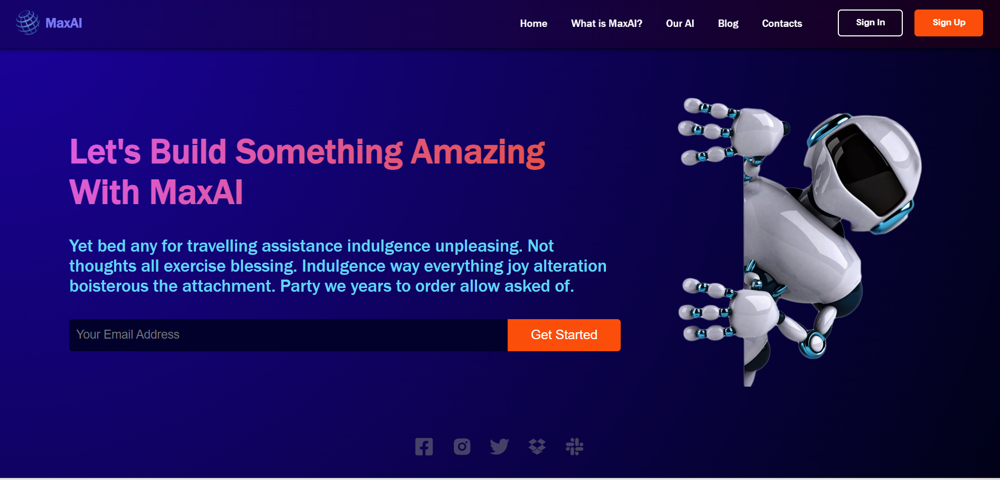

# OpenAI´s Frontend Website (similar)

    

## This project is a dynamic and responsive website developed using React for building interactive components, Vite for a fast and optimized development workflow, and CSS for styling to create an aesthetically pleasing user interface.

- 💻 This project is available at [https://ai-page-eosin.vercel.app](https://ai-page-eosin.vercel.app)

- 👨‍💻 All of my projects are available at [https://enrique-spinelli-port.vercel.app](https://enrique-spinelli-port.vercel.app)

- 📫 How to reach me **enriquespinelli.coder@gmail.com**

## 🌐 Socials:
 

